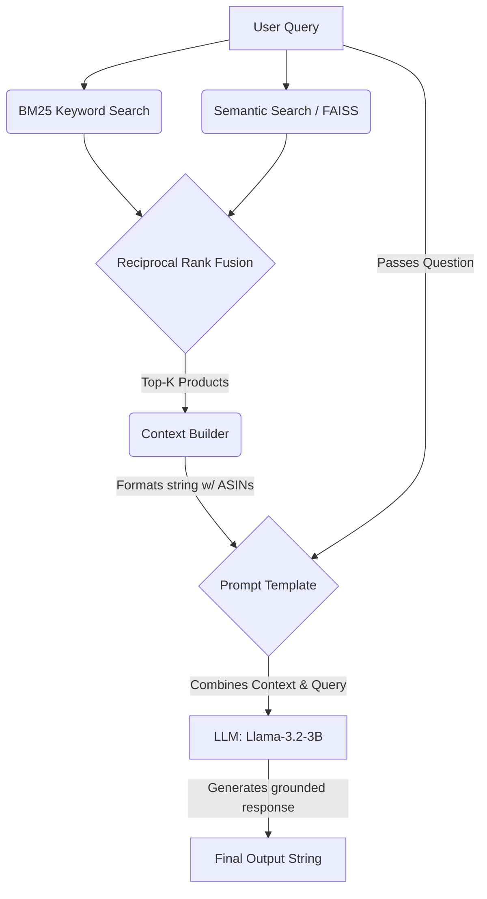

# Smart Amazon Product Query Assistant

## Overview

The Smart Amazon Product Query Assistant is an interactive AI shopping tool built on the Amazon Reviews 2023 (All Beauty) dataset. It leverages a Hybrid Retrieval system (BM25 + FAISS Semantic Search) to scan thousands of product reviews and metadata. It then uses a local Large Language Model (Llama 3.2 via Ollama) to synthesize those reviews and generate factual, context-grounded recommendations through a custom Retrieval-Augmented Generation (RAG) pipeline via a Streamlit web interface.

**Dataset Category:** All Beauty (Amazon Reviews 2023)

## Team

- Gaurang Ahuja (ga446)
- Sidharth Malik (sidmlk07)

## System Architecture & Workflows

### Model Choice

This application utilizes **Llama 3.2 (3B)** via Ollama as the core Large Language Model. This model was chosen because it runs efficiently on local hardware while providing excellent instruction-following capabilities, which is critical for enforcing strict RAG constraints (like price limits and avoiding hallucinations).

### 1. Semantic RAG Workflow

Our baseline RAG pipeline relies on dense vector embeddings.

- **Retriever:** We use `SentenceTransformers` to embed the user's query and perform a cosine similarity search against our product database using a `FAISS` vector index.
- **Generator:** The top retrieved product reviews and metadata are formatted into a strict context block. The LLM is prompted to answer the user's query using *only* this context, ensuring factual, grounded recommendations.

### 2. Hybrid RAG Workflow (Production)

To capture both broad concepts and exact keyword matches, our final production app uses a Hybrid Search pipeline.

- **Retriever:** The user's query is simultaneously passed through our FAISS Semantic index and a BM25 keyword index.
- **Fusion:** We use **Reciprocal Rank Fusion (RRF)** to combine the results from both engines. Documents that rank highly in *both* systems are pushed to the top, mitigating the weaknesses of using either system in isolation.
- **Generator:** The fused Top-K documents are parsed into our Context Builder and sent to Llama 3.2, which evaluates the exact constraints of the user's prompt against the retrieved product metadata.

## RAG Pipeline Workflow

The flowchart below visualizes our LCEL LangChain RAG architecture:



## Setup

### 1. Clone the repo

```bash
git clone git@github.com:UBC-MDS/DSCI_575_project_sidmlk07_ga446.git
cd DSCI_575_project_sidmlk07_ga446
```

### 2. Create and activate the environment

This project uses Conda for environment management.

```bash
conda env create -f environment.yml
conda activate dsci575
```

### 3. Configure environment variables

Create a `.env` file in the root directory of the project. Add any necessary environment variables or API keys required for the app to run:

```bash
cp .env.example .env
```

### 4. Download data

Download the `All_Beauty.jsonl.gz` and `meta_All_Beauty.jsonl.gz` files from
[Amazon Reviews 2023 Dataset](https://amazon-reviews-2023.github.io/) and place them in `data/raw/`.

### 5. Build indexes

Run the exploratory data analysis (EDA) notebook first (`milestone1_exploration.ipynb`) to understand the data. Then run the following in sequence:

```bash
python src/prepare_data.py
python src/bm25.py
python src/semantic.py
```

### 6. Setup Local LLM (Milestone 2 Requirement)

This application uses a local LLM via Ollama to power the Retrieval-Augmented Generation (RAG) pipeline.

1. Download and install [Ollama](https://ollama.com/).
2. **Crucial Step:** Open the Ollama application on your computer and make sure it is running in the background. You must do this at least once to install the command-line tools and start the background server. You should see the Ollama alpaca icon in your system menu bar.
3. Open your terminal and pull the Llama 3.2 model:

```bash
ollama pull llama3.2
```

**Step 6.1: Test the Local Server**
Verify the model is installed and running correctly by chatting with it directly in your terminal:

```bash
ollama run llama3.2
```

*(Type `/bye` to exit the chat when you are done).*

**Step 6.2: Test the Python Connection**
Run the basic LLM generator script to ensure LangChain can successfully communicate with your local Ollama server (this tests the LLM in isolation):

```bash
python src/test_llm.py
```

**Step 6.3: Test the Hybrid RAG Pipeline**
Finally, test the complete backend to ensure the LLM is properly reading from the BM25 and Semantic search indexes:

```bash
python src/hybrid_rag_pipeline.py
```

### 7. Run the app

Launch the interactive Streamlit assistant. The app will use Hybrid Search (BM25 + Semantic) to retrieve relevant products and the local Llama 3.2 model to generate a grounded, conversational recommendation.

```bash
streamlit run app/app.py
```

## Usage Examples & Expected Output

Once the Streamlit app is running, you can explore the different retrieval methods. The UI is split into two main tabs.

### 1. Search Only

This tab allows you to test out our baseline search algorithms. It returns the **Top 5** (although this can be changed) product matches, displaying the Title, Rating, Price, and a small review snippet.

- **BM25 Mode (Keyword Search):** Best for exact terminology.
  - *Try querying:* `salicylic acid face wash`
  - *Expected Output:* The system will strictly return products where those exact words appear frequently in the title or reviews.
- **Semantic Mode (Vector Search):** Best for conceptual matching.
  - *Try querying:* `product to keep my hair from getting frizzy in the rain`
  - *Expected Output:* Even if the word "rain" isn't in the product description, FAISS will return humidity control and anti frizz serums because they share the same dense vector space.

### 2. RAG Assistant

This tab automatically runs a **Hybrid Search (BM25 + Semantic via Reciprocal Rank Fusion)** in the background to capture the best of both worlds, and then passes the merged Top 5 results to the local Llama 3.2 model.

- **The Prompt:** Try a complex query with strict negative constraints:
  > *"What is a good daily sunscreen for dark skin tones that leaves no white cast under $30?"*

- **Expected Output Structure:**
    1. **The AI Answer:** The LLM will evaluate the Top 5 hybrid results, automatically filter out any sunscreens that cost more than $30 or cause a "white cast," and write a conversational recommendation based *only* on the surviving products.
    2. **Source Attribution:** Below the generated answer, you will see a list of numbered drop-down expanders (e.g., `[1]`, `[2]`). These represent the exact underlying Amazon products the LLM used to form its answer, allowing you to manually verify the ASIN, price, and raw review data.

## Dataset & Data Processing

**NOTE:** Due to time and memory constraints when computing dense vector embeddings, we limited the processed corpus to a subset of 5,000 records (configurable via `MAX_REVIEWS` in `prepare_data.py`)

**Source:** Amazon Reviews 2023 (All Beauty category).

- **Reviews file:** Contains user ratings, review text, timestamps, and product IDs.
- **Metadata file:** Contains product titles, descriptions, features, and pricing.

**Preprocessing Steps (`src/prepare_data.py` & `src/utils.py`):**
To safely handle the large files and prepare the data for retrieval, we execute the following pipeline:

1. **Incremental Parquet Conversion:** Raw `.jsonl.gz` files are loaded and processed incrementally in chunks (to prevent memory crashes) and converted into `.parquet` files (`reviews.parquet`, `metadata.parquet`).
2. **Field Merging:** We join the reviews and metadata dataframes using `parent_asin` and combine the `title`, `description`, `features`, and `review_text` into a single `combined_text` field for each document. Missing fields are safely imputed with empty strings.
3. **Text Normalization:** The combined text is converted to lowercase to ensure case-insensitive matching.
4. **Punctuation Removal:** Special characters and punctuation are stripped using regular expressions.
5. **Stopword Removal:** Common English stopwords are filtered out using the NLTK library to reduce noise for the BM25 index and prevent common words (like "for" or "the") from skewing results.

## Retrieval Methods

Our application allows users to compare two distinct retrieval systems i.e. BM25 and semantic search:

### 1. BM25 (Keyword Search)

- **File:** `src/bm25.py`
- **Workflow:** Uses the `rank_bm25` package (`BM25Okapi`). The preprocessed `combined_text` corpus is tokenized and indexed. When a user submits a query, it undergoes the exact same preprocessing pipeline (lowercasing, punctuation/stopword removal) before being scored against the index using exact term matching, term frequency, and inverse document frequency. The index and tokenized corpus are serialized and saved as `.pkl` files for fast loading.

### 2. Semantic Search (Dense Vector Retrieval)

- **File:** `src/semantic.py`
- **Workflow:** Uses `sentence-transformers` (specifically `all-MiniLM-L6-v2`) to convert the `combined_text` of each document into dense vector embeddings. The embeddings are L2-normalized and indexed using **FAISS** (`IndexFlatIP`) for inner-product similarity search (mathematically equivalent to cosine similarity after normalization). User queries are embedded on the fly, normalized, and compared against the FAISS index to find the nearest semantic neighbors.
